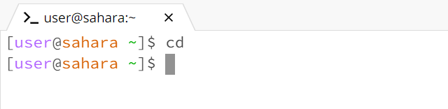

__Lab Report 1 - Remote Access and FileSystem (Week 1)__
-------------

- Using Command `cd`
  1) No arguments
    _Working Directory_: home  
     The `cd` command changes the current directory to the one mentioned as the argument. Since there is no argument, `cd` remains in the working directory which is home here.
        _Error_: No Errors  
     
      
  2) Command with a path to a directory
        _Working Directory_: home  
       The `cd` command changes the current directory to lecture1.
       _Error_: No Errors  

     
   3) Command with a path to a file
        _Working Directory_: lecture1  
       The `cd` command changes the current directory to messages.
       _Error_: No Errors  

      

- Using Command `ls`
  1) No arguments
      _Working Directory_: home  
    The `ls` command displays the files or folders in the path entered as the argument. Since there is no argument, the folders in the current directory are displayed.
       _Error_: No Errors  

       
  2) Command with a path to a directory
        _Working Directory_: home  
      The `ls` command displays the folders in the lecture1 path.
       _Error_: No Errors  

       
   3) Command with a path to a file
        _Working Directory_: home  
     _Error_: The `ls` command cannot display the folders or files present in messages without first moving to the lecture1 directory.

      
       _Working Directory_: lecture1  
     The `ls` command now displays the files present in messages.
       _Error_: No Errors  

      

- Using Command `cat`
  1) No arguments
       _Working Directory_: home  
     The `cat` command prints out the contents of the file. Since there is no argument, the `cat` command will display the content of the standard input (stdin). This means it will wait to input text manually.
       _Error_: No Errors  

     
  
  

     

