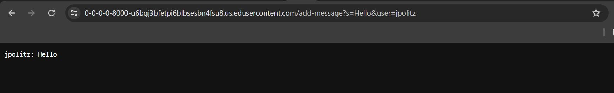
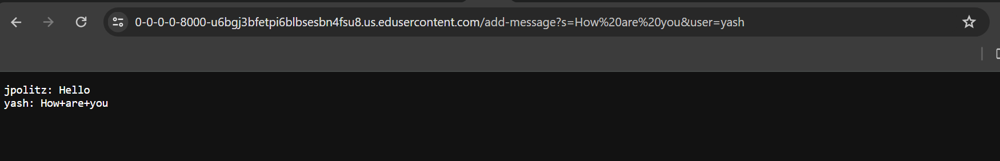
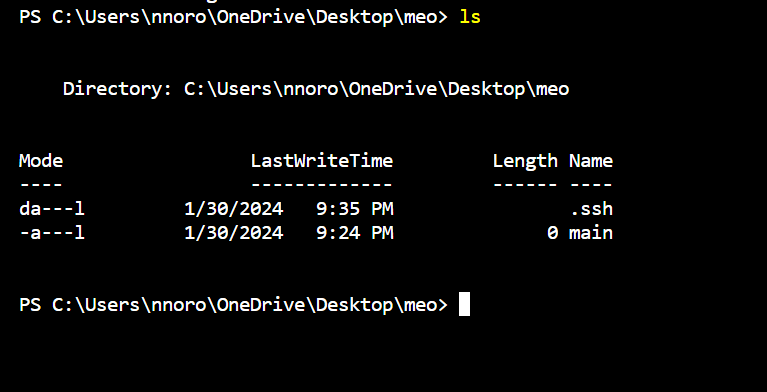

__Lab Report 2 - Servers and SSH Keys (Week 3)__
-------------

Code for ChatServer:

     import java.io.IOException;
     import java.net.URI;

    class ChatServerOne implements URLHandler {
    private String chatMessages = "";
    public String handleRequest(URI url) {
             
        if (url.getPath().equals("/add-message")) {
        String queryString = url.getQuery();
        String[] parameters = queryString.split("&");

        String user = "";
        String message = "";

        for (String parameter : parameters) {
            String[] keyValue = parameter.split("=");
            if (keyValue.length == 2) {
                if (keyValue[0].equals("s")) {
                    message = keyValue[1];
                } else if (keyValue[0].equals("user")) {
                    user = keyValue[1];
                }
            }
        }

        if (!user.isEmpty() && !message.isEmpty()) {
            chatMessages += String.format("%s: %s\n", user, message);
            return chatMessages;
        }
    }
    return "404 Not Found!";
    }
    }

    class ChatServer {
    public static void main(String[] args) throws IOException {
        if(args.length == 0){
            System.out.println("Missing port number! Try any number between 1024 to 49151");
            return;
        }

        int port = Integer.parseInt(args[0]);

        Server.start(port, new Handler());
    }
    }

Screenshots:

 _Method_: `handleRequest`, `main` 
  _Arguments_: `URI url` in `handleRequest`, `String[] args` for `main` 
  _Fields_: `chatMessages` in `handleRequest` 
  _Changes_: `chatMessages` gets updated with the new chat message `jpolitz: Hello\n` 

 _Method_: `handleRequest`, `main` 
  _Arguments_: `URI url` in `handleRequest`, `String[] args` for `main` 
  _Fields_: `chatMessages` in `handleRequest` 
  _Changes_: `chatMessages` gets updated with the new chat message `jpolitz: Hello\nyash: How are you\n` 

Part 2
---
  __Question 2__  

  __Question 3__  

