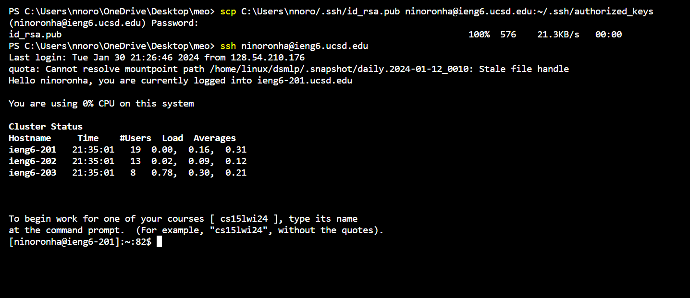

__Lab Report 2 - Servers and SSH Keys (Week 3)__
-------------

Code for ChatServer:

     import java.io.IOException;
     import java.net.URI;

    class ChatServerOne implements URLHandler {
    private String chatMessages = "";
    public String handleRequest(URI url) {
             
        if (url.getPath().equals("/add-message")) {
        String queryString = url.getQuery();
        String[] parameters = queryString.split("&");

        String user = "";
        String message = "";

        for (String parameter : parameters) {
            String[] keyValue = parameter.split("=");
            if (keyValue.length == 2) {
                if (keyValue[0].equals("s")) {
                    message = keyValue[1];
                } else if (keyValue[0].equals("user")) {
                    user = keyValue[1];
                }
            }
        }

        if (!user.isEmpty() && !message.isEmpty()) {
            chatMessages += String.format("%s: %s\n", user, message);
            return chatMessages;
        }
    }
    return "404 Not Found!";
    }
    }

    class ChatServer {
    public static void main(String[] args) throws IOException {
        if(args.length == 0){
            System.out.println("Missing port number! Try any number between 1024 to 49151");
            return;
        }

        int port = Integer.parseInt(args[0]);

        Server.start(port, new Handler());
    }
    }

Screenshots:

 _Method_: `handleRequest()`, `getQuery()` 
  _Arguments_: `URI url` in `handleRequest`  
  _Fields_: `String queryString`, `String[] parameters`, `String user`, and `String message` 
  _Changes_: `String queryString` is dependent on `URI url`, and `String[] parameters`, `String user`, `String message` depend on `String queryString`. Once `/add-message` following different queries are added to `URI url`, it changes the values to `String[]`
 `parameters`,`String user`, `String message`, which changes the printed messages on the webserver. In this case, `getQuery()` got the value of `String user` "jpolitz" and the value of `String message` "Hello", and it printed "jpolitz: Hello".

 _Method_: `handleRequest()`, `getQuery()` 
  _Arguments_: `URI url` in `handleRequest`  
  _Fields_: `String queryString`, `String[] parameters`, `String user`, and `String message` 
  _Changes_: `String queryString` is dependent on `URI url`, and `String[] parameters`, `String user`, `String message` depend on `String queryString`. Once `/add-message` following different queries are added to `URI url`, it changes the values to `String[]`
 `parameters`,`String user`, `String message`, which changes the printed messages on the webserver. In this case, `getQuery()` got the value of `String user` "yash" and the value of `String message` "How are you", and it printed "yash: How+are+you".

Part 2
---
  __Question 1__  

The absolute path to the private key: `C:\Users\nnoro/.ssh/id_rsa`

  __Question 2__  

The absolute path to the public key on ieng6's file system: `C:\Users\nnoro/.ssh/id_rsa.pub`

  __Question 3__  

Part 3
--
I learnt how to set up SSH keys which did not require entering the password while logging in to the remote server. I also learnt how `/` and before `?` is a path and after `?` is a query. Also found out what `mkdir` and `scp` stood for and how to use those commands.
