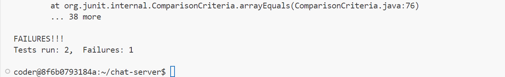

Lab Report 3 - Bugs and Commands (Week 5)
---
I chose the bug (`reverseInPlace`) from `ArrayExamples.java`. The buggy program was tested using `ArrayTests.java`

Failure-inducing JUnit Test:
```
@Test 
public void testReverseInPlace() {
    int[] input1 = {1, 2, 4};
    ArrayExamples.reverseInPlace(input1);
    assertArrayEquals(new int[]{4, 2, 1}, input1);
}
```
Not a failure-inducing JUnit Test:
```
@Test
public void testReversed() {
    int[] input1 = { };
    assertArrayEquals(new int[]{ }, ArrayExamples.reversed(input1));
}
```
Screenshot of output while running these two tests:



Before code change:
```
static void reverseInPlace(int[] arr) {
    for(int i = 0; i < arr.length; i += 1) {
      arr[i] = arr[arr.length - i - 1];
    }
  }
```
After code change:
```
 static void reverseInPlace(int[] arr) {
    for (int i = 0; i < arr.length / 2; i++) {
        int var = arr[i];
        arr[i] = arr[arr.length - i - 1];
        arr[arr.length - i - 1] = var;
    }
}
```


