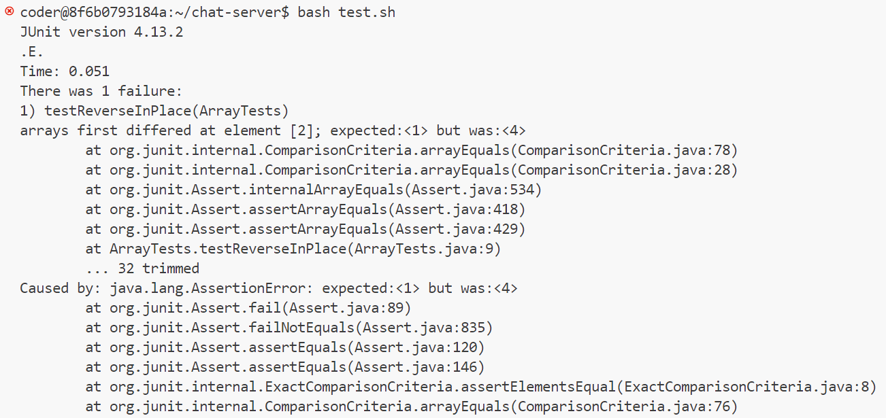

Lab Report 3 - Bugs and Commands (Week 5)
---
I chose the bug (`reverseInPlace`) from `ArrayExamples.java`. The buggy program was tested using `ArrayTests.java`

_Failure-inducing JUnit Test_:
```
@Test 
public void testReverseInPlace() {
    int[] input1 = {1, 2, 4};
    ArrayExamples.reverseInPlace(input1);
    assertArrayEquals(new int[]{4, 2, 1}, input1);
}
```
_Not a failure-inducing JUnit Test_:
```
@Test
public void testReversed() {
    int[] input1 = { };
    assertArrayEquals(new int[]{ }, ArrayExamples.reversed(input1));
}
```
_Screenshot of output while running these two tests_:



_Before code change_:
```
static void reverseInPlace(int[] arr) {
    for(int i = 0; i < arr.length; i += 1) {
      arr[i] = arr[arr.length - i - 1];
    }
  }
```
_After code change_:
```
 static void reverseInPlace(int[] arr) {
    for (int i = 0; i < arr.length / 2; i++) {
        int var = arr[i];
        arr[i] = arr[arr.length - i - 1];
        arr[arr.length - i - 1] = var;
    }
}
```
_Fix_: In the corrected code, we only loop through half of the array's length because when we're reversing an array, we need to swap elements from both ends towards the middle. This approach ensures that we don't swap elements twice. We use a temporary variable to temporarily hold the value of one element while we move another element. This prevents the loss of data during the swapping process. We swap the element at the current index (i) with the element at the opposite index from the end of the array (arr.length - i - 1). This swapping continues until we've swapped all elements from one end to the other.

Part 2 - Researching Commands
---
1)`-size n[cwbkMG]`
<br> _Example 1_ <br>
Code:
```
 find technical/  -type f -size +90k
```
Output:
```
technical/911report/chapter-1.txt
technical/911report/chapter-12.txt
technical/911report/chapter-13.2.txt
technical/911report/chapter-13.3.txt
technical/911report/chapter-13.4.txt
technical/911report/chapter-13.5.txt
technical/911report/chapter-3.txt
technical/911report/chapter-5.txt
technical/911report/chapter-6.txt
technical/911report/chapter-7.txt
technical/911report/chapter-9.txt
technical/biomed/1471-2105-3-2.txt
technical/government/About_LSC/commission_report.txt
technical/government/About_LSC/State_Planning_Report.txt
technical/government/Alcohol_Problems/Session3-PDF.txt
technical/government/Env_Prot_Agen/bill.txt
technical/government/Env_Prot_Agen/ctm4-10.txt
technical/government/Env_Prot_Agen/multi102902.txt
technical/government/Env_Prot_Agen/tech_adden.txt
technical/government/Gen_Account_Office/ai00134.txt
technical/government/Gen_Account_Office/ai9868.txt
technical/government/Gen_Account_Office/d01376g.txt
technical/government/Gen_Account_Office/d01591sp.txt
technical/government/Gen_Account_Office/d0269g.txt
technical/government/Gen_Account_Office/d02701.txt
technical/government/Gen_Account_Office/gg96118.txt
technical/government/Gen_Account_Office/GovernmentAuditingStandards_yb2002ed.txt
technical/government/Gen_Account_Office/im814.txt
technical/government/Gen_Account_Office/May1998_ai98068.txt
technical/government/Gen_Account_Office/pe1019.txt
technical/government/Gen_Account_Office/Sept27-2002_d02966.txt
technical/government/Gen_Account_Office/Statements_Feb28-1997_volume.txt
technical/government/Gen_Account_Office/Testimony_cg00010t.txt
```
This command gives the names of the files which have a size larger than the specified size. `+90` denotes that the size of the files is larger than 90 KB, and `k`specifies the unit of measurement which is kilobytes here.

<br> _Example 2_ <br>
Code:
```
find technical/  -type f -size 3k
```
Output:
```
technical/government/Media/Advocate_for_Poor.txt
technical/government/Media/agency_expands.txt
technical/government/Media/Aid_Gets_7_Million.txt
technical/government/Media/All_May_Have_Justice.txt
technical/government/Media/AP_LawSchoolDebts.txt
technical/government/Media/Attorney_gives_his_time.txt
technical/government/Media/A_Perk_of_Age.txt
technical/government/Media/Barnes_pro_bono.txt
technical/government/Media/Barnes_Volunteers.txt
technical/government/Media/Bias_on_the_Job.txt
technical/government/Media/Boone_legal_service.txt
technical/government/Media/BusinessWire2.txt
technical/government/Media/Civil_Matters.txt
technical/government/Media/Commercial_Appeal.txt
technical/government/Media/Do-it-yourself_divorce.txt
technical/government/Media/Donald_Hilliker.txt
technical/government/Media/fight_domestic_abuse.txt
technical/government/Media/Free_legal_service.txt
technical/government/Media/Funding_cuts_force.txt
technical/government/Media/FY_04_Budget_Outlook.txt
technical/government/Media/Helping_Hands.txt
technical/government/Media/Higher_court.txt
technical/government/Media/Legal_Aid_campaign.txt
technical/government/Media/Legal_Aid_looks_to_legislators.txt
technical/government/Media/Legal_Aid_Society.txt
technical/government/Media/Legal_hotline.txt
technical/government/Media/Low-income_children.txt
technical/government/Media/Owning_a_Piece.txt
technical/government/Media/Paralegal_Honored.txt
technical/government/Media/Poor_Lacking_Legal_Aid.txt
technical/government/Media/Providing_Legal_Aid.txt
technical/government/Media/residents_sue_city.txt
technical/government/Media/The_Columbian.txt
technical/government/Media/Valley_Needing_Legal_Services.txt
technical/government/Media/Wilmington_lawyer.txt
technical/government/Media/Wingates_winds.txt
technical/plos/pmed.0010025.txt
technical/plos/pmed.0010029.txt
technical/plos/pmed.0010067.txt
technical/plos/pmed.0010068.txt
technical/plos/pmed.0020021.txt
technical/plos/pmed.0020022.txt
technical/plos/pmed.0020024.txt
technical/plos/pmed.0020027.txt
technical/plos/pmed.0020085.txt
technical/plos/pmed.0020086.txt
technical/plos/pmed.0020145.txt
technical/plos/pmed.0020278.txt
technical/plos/pmed.0020281.txt
```
This command gives the names of the files which have a size larger than the specified size. `3` denotes that the size of the files is 3 KB, and `k`specifies the unit of measurement which is kilobytes here.

<br> __Source__ : ChatGPT (Prompt: find command line options) <br>


