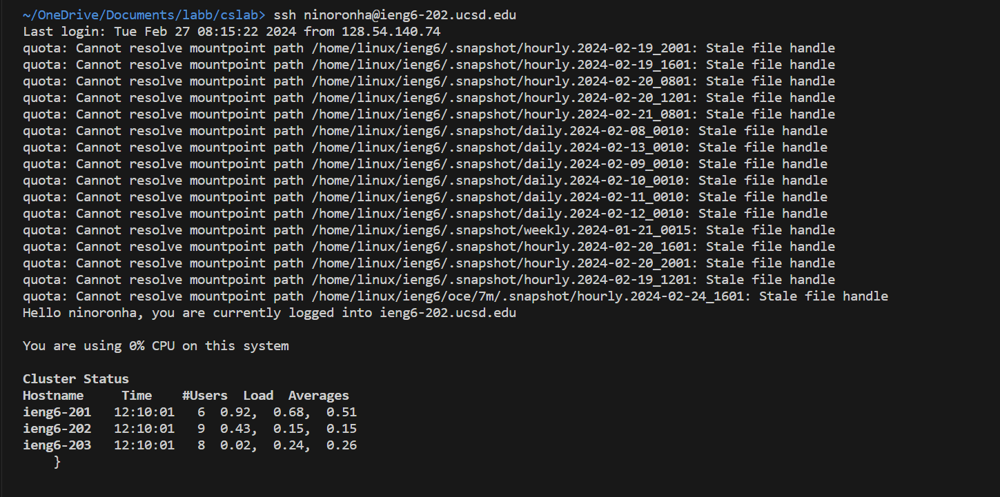

Lab Report 4 - Vim (Week 7)
--------
__Step 1__: Log into ieng6

_Keys pressed:_ `ssh<space>ninoronha@ieng6-202.ucsd.edu<enter>`

 __Step 2__: Clone your fork of the repository from your Github account (using the SSH URL)

_Keys pressed:_ `git<space>clone<space>git@github.com:ninoro/lab7.git<enter>`

 __Step 3__: Run the tests, demonstrating that they fail

_Keys pressed:_ `bash<space>test.sh<space>`

 __Step 4__: Edit the code file to fix the failing test

  __Initial code:__  

  __Edited code:__  

  _Keys pressed:_ `<up><up><up>`,`<right><right><right><right><right><right><right><right><right><right><right><right>` the cursor was 3 lines down so I pressed the up arrow 3 times to get to the line and then the right arrow 12 times to get to the '1' number, `i` I pressed `i` to get into the insert mode,`<backspace>`,`2` I pressed backspace to delete the '1' and added '2',`<esc>` this was used to exit the insert mode,`:wq` to save changes and close vim.  

 __Step 5__: Run the tests, demonstrating that they now succeed

  _Keys pressed:_ `bash<space>test.sh<space>`  

 __Step 6__: Commit and push the resulting change to your Github account (you can pick any commit message!)

  _Keys pressed:_ Clicked on `Source Control` view, and on `Commit & Push` to push the changes.

 

 
 

