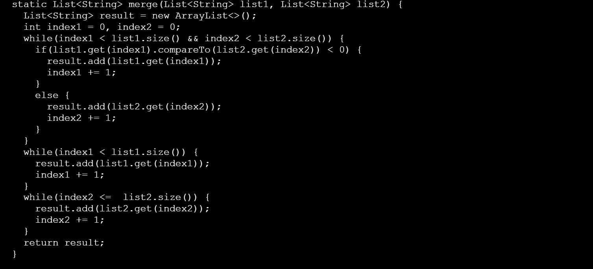

Lab Report 5 - Putting it All Together (Week 9)
----
__Part 1 – Debugging Scenario__

_Student Post_

I do not know why my code is not running and am having trouble with debugging the ListExamples.java file. I think that the while loop condition in the merge method might be contributing to the out-of-bounds error. The loop is defined as while index < length, but I have a feeling it should be adjusted to while index < length - 1.

_TA Response_

Hello! I took a look at the code snippet you have shared and it does seem likely that the while loop condition in the merge method is causing the `IndexOutOfBoundsException`. Since ArrayList indices are zero-based, attempting to access index 1 is causing the `IndexOutOfBoundsException`. Adjusting the loop condition using a '<' should prevent accessing an index that's out of bounds.

_After Fix_

Changing the operator of the last while loop to '<' instead of '<=' helped debug my code and my test cases passed successfully. The index would try to access index 1, which was higher than the length of the list, and this would put it out of bounds.

_Setup_

Shows the various directories and files.

_Content of each file before fix_

  __TestListExamples.java__  

__ListExamples.java__

  __test.sh__  

I executed the command `bash test.sh` to trigger the bug. To address the issue, I removed the equal sign in the final while loop. Specifically, the while loop, `index2 <= list2.size()` was modified to `index2 < list2.size()`.

__Part 2 – Reflection__

I learnt about using bash scripts to compile and run the java files. I also learnt about various commands like `wc` in order to extract specific information like the word count, the number of lines etc. from the different files present in the folder.

