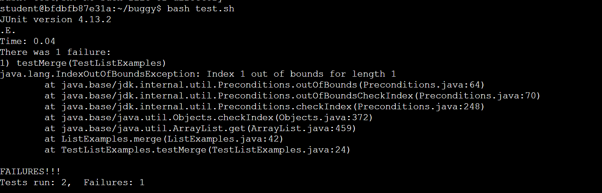

Lab Report 5 - Putting it All Together (Week 9)
----
__Part 1 – Debugging Scenario__

_Student Post_

I do not know why my code is not running and am having trouble with debugging the ListExamples.java file. I think that the while loop condition in the merge method might be contributing to the out-of-bounds error. The loop is defined as while index < length, but I have a feeling it should be adjusted to while index < length - 1.

# TA Response

Hello! I took a look at the code snippet you have shared and it does seem likely that the while loop condition in the merge method is causing the `IndexOutOfBoundsException`. Since ArrayList indices are zero-based, attempting to access index 1 is causing the `IndexOutOfBoundsException`. Adjusting the loop condition to using a '<=' should indeed prevent accessing an index that's out of bounds.

# After Fix

